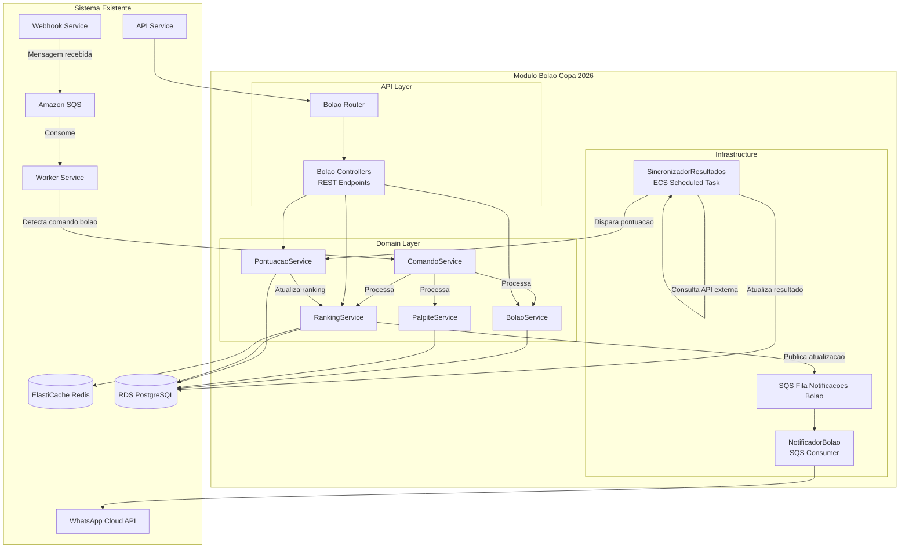
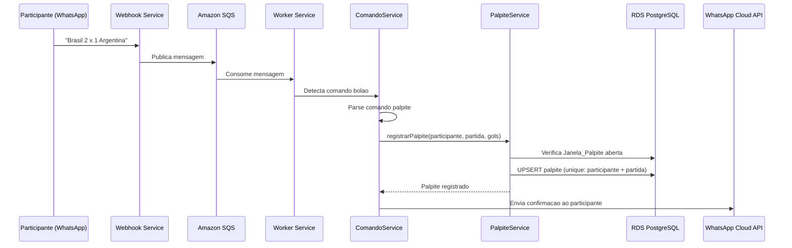
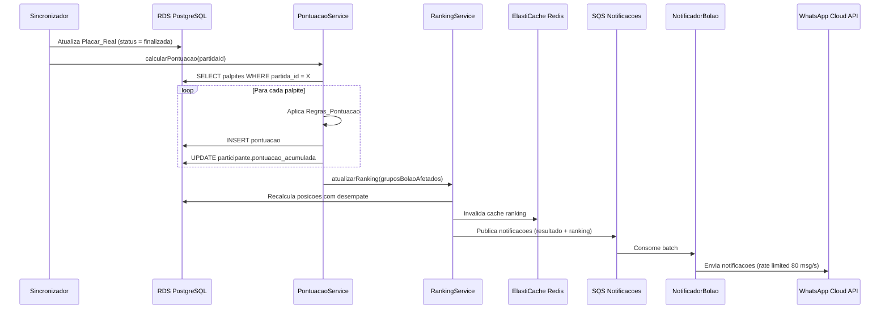
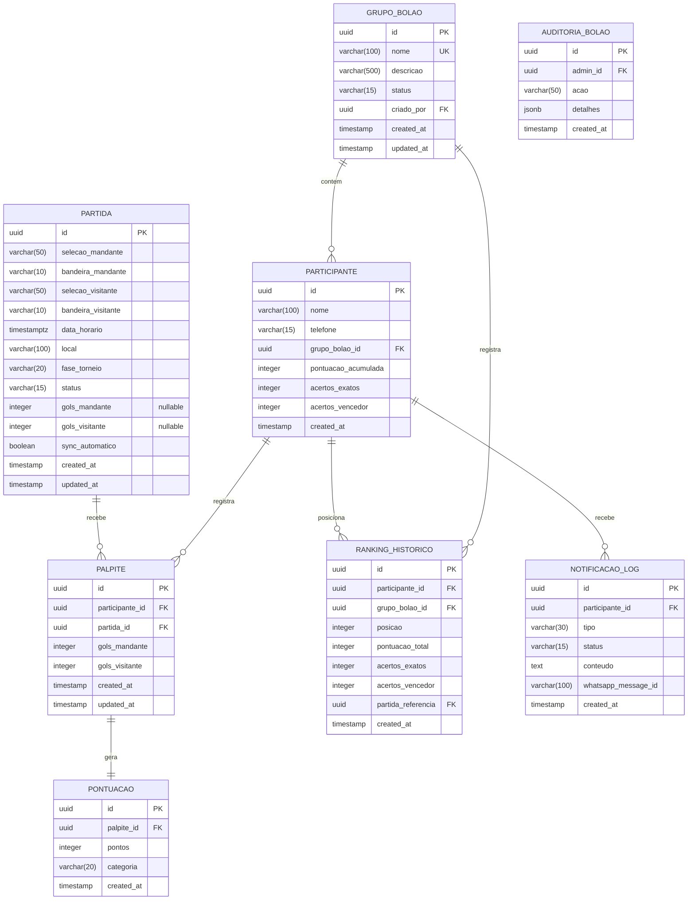

# Design Document: Bolao Copa 2026

## Overview

Este documento descreve a arquitetura e design tecnico do modulo **Bolao Copa 2026**, um sistema de palpites para a Copa do Mundo FIFA 2026 integrado ao Painel Multiatendente WhatsApp existente. O modulo permite que participantes registrem palpites de placares via WhatsApp ou painel web, acumulem pontos com base na precisao dos palpites e acompanhem um ranking em tempo real.

O modulo e implementado como uma extensao do sistema existente, compartilhando infraestrutura (RDS PostgreSQL, ElastiCache Redis, ECS Fargate) e reutilizando servicos ja implementados (envio de mensagens WhatsApp, autenticacao JWT, webhook handler).

### Decisoes Tecnicas Principais

| Decisao | Escolha | Justificativa |
|---------|---------|---------------|
| Integracao | Modulo interno ao monolito existente | Compartilha infraestrutura, evita complexidade de microsservico separado |
| Roteamento WhatsApp | Command parser no Worker existente | Reutiliza pipeline de mensagens, adiciona detector de comandos bolao |
| Pontuacao | Calculo sincrono no Worker | Operacao CPU-bound rapida, nao justifica fila separada |
| Sincronizacao de Resultados | Cron job via ECS Scheduled Task | Consulta API externa a cada 5 min durante jogos |
| Notificacoes | Fila SQS dedicada para batch | Respeita rate limit WhatsApp (80 msg/s) com backoff |
| Ranking | Materializado em tabela + cache Redis | Consultas frequentes, atualizacao eventual (< 60s) |
| PBT Library | fast-check (ja no projeto) | Consistencia com stack existente |

### Escopo

O modulo cobre:
- Criacao e gestao de grupos de bolao
- Registro de participantes via WhatsApp e painel web
- Cadastro e gestao de partidas da Copa 2026
- Registro de palpites com janela temporal
- Calculo automatico de pontuacao com regras definidas
- Ranking com criterios de desempate
- Notificacoes automaticas via WhatsApp
- Sincronizacao automatica de resultados via API externa
- Administracao completa pelo painel web existente
- Interacao via comandos WhatsApp (JOGOS, RANKING, MEUS PALPITES, etc.)

## Architecture

### Diagrama de Integracao com Sistema Existente



### Fluxo de Registro de Palpite via WhatsApp



### Fluxo de Calculo de Pontuacao



### Estrategia de Deploy

O modulo Bolao e deployado como parte dos servicos existentes:

- **API Service**: Novos controllers e rotas adicionados ao Express existente
- **Worker Service**: Novo handler de comandos bolao no pipeline de processamento
- **Sincronizador**: ECS Scheduled Task separado (cron a cada 5 min)
- **Notificador Bolao**: Consumer SQS dedicado (pode rodar no Worker ou task separada)

Nao ha necessidade de novos servicos ECS - o modulo se integra aos existentes.

## Components and Interfaces

### Estrutura do Modulo Bolao

```
src/
  domain/
    bolao/
      entities/
        grupo-bolao.entity.ts
        participante.entity.ts
        partida.entity.ts
        palpite.entity.ts
        pontuacao.entity.ts
        ranking-entry.entity.ts
      services/
        bolao.service.ts
        palpite.service.ts
        pontuacao.service.ts
        ranking.service.ts
        comando-bolao.service.ts
        sincronizador-resultados.service.ts
        notificador-bolao.service.ts
      repositories/
        grupo-bolao.repository.ts
        participante.repository.ts
        partida.repository.ts
        palpite.repository.ts
        pontuacao.repository.ts
        ranking.repository.ts
  api/
    controllers/
      bolao/
        grupo-bolao.controller.ts
        partida.controller.ts
        palpite.controller.ts
        ranking.controller.ts
        participante.controller.ts
    routes/
      bolao.routes.ts
  worker/
    handlers/
      bolao-comando.handler.ts
  infra/
    bolao/
      sincronizador.task.ts
      notificador.consumer.ts
      fonte-resultados.client.ts
tests/
  unit/
    bolao/
      pontuacao.service.test.ts
      ranking.service.test.ts
      comando-bolao.service.test.ts
      palpite.service.test.ts
  integration/
    bolao/
      fluxo-palpite.test.ts
      fluxo-pontuacao.test.ts
      ranking-atualizacao.test.ts
  property/
    bolao/
      pontuacao.property.test.ts
      ranking.property.test.ts
      palpite-janela.property.test.ts
      comando-parser.property.test.ts
```

### API REST - Endpoints do Bolao

```typescript
// === Grupos de Bolao (Admin) ===
GET    /api/v1/bolao/grupos                    // Lista grupos com contagem de participantes
POST   /api/v1/bolao/grupos                    // Criar grupo
PATCH  /api/v1/bolao/grupos/:id                // Atualizar grupo (nome, descricao, status)
DELETE /api/v1/bolao/grupos/:id                // Excluir grupo (somente sem participantes)
GET    /api/v1/bolao/grupos/:id/participantes  // Lista participantes do grupo
POST   /api/v1/bolao/grupos/:id/participantes  // Cadastrar participante manualmente
GET    /api/v1/bolao/grupos/:id/ranking        // Ranking completo paginado
GET    /api/v1/bolao/grupos/:id/ranking/export // Exportar ranking CSV

// === Partidas (Admin) ===
GET    /api/v1/bolao/partidas                  // Lista partidas (filtro por fase, status)
POST   /api/v1/bolao/partidas                  // Cadastrar partida
POST   /api/v1/bolao/partidas/importar         // Importacao em lote (ate 64)
PATCH  /api/v1/bolao/partidas/:id              // Atualizar partida
POST   /api/v1/bolao/partidas/:id/resultado    // Registrar resultado manual
PATCH  /api/v1/bolao/partidas/:id/sync         // Ativar/desativar sync automatico

// === Palpites (Admin visualiza, participante registra) ===
GET    /api/v1/bolao/partidas/:id/palpites     // Lista palpites de uma partida (admin)
GET    /api/v1/bolao/meus-palpites             // Palpites do participante autenticado
POST   /api/v1/bolao/partidas/:id/palpite      // Registrar/atualizar palpite

// === Dashboard (Admin) ===
GET    /api/v1/bolao/dashboard                 // Metricas gerais do bolao
GET    /api/v1/bolao/notificacoes              // Log de notificacoes paginado

// === Participante (autenticado via WhatsApp) ===
GET    /api/v1/bolao/ranking                   // Ranking do grupo do participante
GET    /api/v1/bolao/proximos-jogos            // Proximas partidas com status palpite
```

### Interfaces de Servico

```typescript
// === bolao.service.ts ===
interface IBolaoService {
  criarGrupo(dados: CriarGrupoDTO): Promise<Result<GrupoBolao, BolaoError>>;
  atualizarGrupo(id: string, dados: AtualizarGrupoDTO): Promise<Result<GrupoBolao, BolaoError>>;
  excluirGrupo(id: string): Promise<Result<void, BolaoError>>;
  listarGrupos(filtros: FiltroGrupos): Promise<PaginatedResult<GrupoBolao>>;
  registrarParticipante(grupoId: string, dados: RegistrarParticipanteDTO): Promise<Result<Participante, BolaoError>>;
  entrarViaConvite(telefone: string, codigo: string): Promise<Result<Participante, BolaoError>>;
}

// === palpite.service.ts ===
interface IPalpiteService {
  registrarPalpite(participanteId: string, partidaId: string, golsMandante: number, golsVisitante: number): Promise<Result<Palpite, PalpiteError>>;
  listarPalpitesParticipante(participanteId: string, limite: number): Promise<Palpite[]>;
  listarPalpitesPartida(partidaId: string): Promise<Palpite[]>;
  verificarJanelaAberta(partidaId: string): Promise<boolean>;
}

// === pontuacao.service.ts ===
interface IPontuacaoService {
  calcularPontuacao(partidaId: string): Promise<Result<PontuacaoResult[], PontuacaoError>>;
  calcularPontuacaoPalpite(palpite: Palpite, placarReal: PlacarReal): PontuacaoCalculo;
}

interface PontuacaoCalculo {
  pontos: number;
  categoria: CategoriaPontuacao;
}

type CategoriaPontuacao = 'exato' | 'diferenca_gols' | 'vencedor' | 'empate' | 'gols_parcial' | 'erro';

// === ranking.service.ts ===
interface IRankingService {
  obterRanking(grupoId: string, pagina: number, tamanhoPagina: number): Promise<PaginatedResult<RankingEntry>>;
  obterRankingTop(grupoId: string, limite: number): Promise<RankingEntry[]>;
  atualizarRanking(grupoId: string): Promise<void>;
  exportarRankingCSV(grupoId: string): Promise<string>;
  obterPosicaoParticipante(grupoId: string, participanteId: string): Promise<RankingEntry | null>;
}

// === comando-bolao.service.ts ===
interface IComandoBolaoService {
  processarMensagem(telefone: string, texto: string): Promise<RespostaComando>;
  parsearComandoPalpite(texto: string): Result<ComandoPalpite, ParseError>;
  identificarComando(texto: string): TipoComando | null;
}

type TipoComando = 'PALPITE' | 'JOGOS' | 'RANKING' | 'MEUS_PALPITES' | 'AJUDA' | 'ENTRAR';

interface RespostaComando {
  tipo: 'texto';
  conteudo: string;
}

// === sincronizador-resultados.service.ts ===
interface ISincronizadorResultados {
  sincronizar(): Promise<SyncResult>;
  consultarFonte(partidaId: string): Promise<Result<PlacarExterno, SyncError>>;
}

interface SyncResult {
  partidasAtualizadas: number;
  erros: SyncError[];
}

// === notificador-bolao.service.ts ===
interface INotificadorBolao {
  notificarResultado(partidaId: string): Promise<void>;
  notificarLembrete24h(partidaId: string): Promise<void>;
  notificarLembrete2h(partidaId: string): Promise<void>;
  notificarRankingAtualizado(grupoId: string): Promise<void>;
}
```

### DTOs e Tipos

```typescript
// === DTOs de Entrada ===
interface CriarGrupoDTO {
  nome: string;          // 1-100 chars
  descricao?: string;    // ate 500 chars
}

interface AtualizarGrupoDTO {
  nome?: string;
  descricao?: string;
  status?: 'aberto' | 'fechado' | 'finalizado';
}

interface RegistrarParticipanteDTO {
  nome: string;          // 1-100 chars
  telefone: string;      // formato E.164, max 15 digitos
}

interface CriarPartidaDTO {
  selecaoMandante: string;      // 1-50 chars
  selecaoVisitante: string;     // 1-50 chars
  dataHorario: string;          // ISO 8601 com timezone
  local: string;                // 1-100 chars
  faseTorneio: FaseTorneio;
}

interface RegistrarResultadoDTO {
  golsMandante: number;   // 0-99 inteiro
  golsVisitante: number;  // 0-99 inteiro
}

// === Enums ===
type StatusGrupoBolao = 'aberto' | 'fechado' | 'finalizado';
type StatusPartida = 'agendada' | 'em_andamento' | 'finalizada' | 'cancelada';
type FaseTorneio = 'fase_de_grupos' | 'oitavas' | 'quartas' | 'semifinal' | 'terceiro_lugar' | 'final';

// === Comando Palpite Parseado ===
interface ComandoPalpite {
  selecaoMandante: string;
  golsMandante: number;
  golsVisitante: number;
  selecaoVisitante: string;
}
```

## Data Models

### Diagrama ER do Modulo Bolao



### DDL Principais

```sql
-- Tabela de Grupos de Bolao
CREATE TABLE grupo_bolao (
    id UUID PRIMARY KEY DEFAULT gen_random_uuid(),
    nome VARCHAR(100) NOT NULL UNIQUE,
    descricao VARCHAR(500),
    status VARCHAR(15) NOT NULL DEFAULT 'aberto'
        CHECK (status IN ('aberto', 'fechado', 'finalizado')),
    criado_por UUID NOT NULL REFERENCES atendente(id),
    created_at TIMESTAMPTZ NOT NULL DEFAULT NOW(),
    updated_at TIMESTAMPTZ NOT NULL DEFAULT NOW()
);

-- Tabela de Participantes
CREATE TABLE participante (
    id UUID PRIMARY KEY DEFAULT gen_random_uuid(),
    nome VARCHAR(100) NOT NULL,
    telefone VARCHAR(15) NOT NULL,
    grupo_bolao_id UUID NOT NULL REFERENCES grupo_bolao(id) ON DELETE RESTRICT,
    pontuacao_acumulada INTEGER NOT NULL DEFAULT 0,
    acertos_exatos INTEGER NOT NULL DEFAULT 0,
    acertos_vencedor INTEGER NOT NULL DEFAULT 0,
    created_at TIMESTAMPTZ NOT NULL DEFAULT NOW(),
    UNIQUE(telefone, grupo_bolao_id)
);

-- Tabela de Partidas
CREATE TABLE partida (
    id UUID PRIMARY KEY DEFAULT gen_random_uuid(),
    selecao_mandante VARCHAR(50) NOT NULL,
    bandeira_mandante VARCHAR(10) NOT NULL,
    selecao_visitante VARCHAR(50) NOT NULL,
    bandeira_visitante VARCHAR(10) NOT NULL,
    data_horario TIMESTAMPTZ NOT NULL,
    local VARCHAR(100) NOT NULL,
    fase_torneio VARCHAR(20) NOT NULL
        CHECK (fase_torneio IN ('fase_de_grupos', 'oitavas', 'quartas', 'semifinal', 'terceiro_lugar', 'final')),
    status VARCHAR(15) NOT NULL DEFAULT 'agendada'
        CHECK (status IN ('agendada', 'em_andamento', 'finalizada', 'cancelada')),
    gols_mandante INTEGER CHECK (gols_mandante >= 0 AND gols_mandante <= 99),
    gols_visitante INTEGER CHECK (gols_visitante >= 0 AND gols_visitante <= 99),
    sync_automatico BOOLEAN NOT NULL DEFAULT TRUE,
    created_at TIMESTAMPTZ NOT NULL DEFAULT NOW(),
    updated_at TIMESTAMPTZ NOT NULL DEFAULT NOW()
);

-- Tabela de Palpites (unicidade por participante + partida)
CREATE TABLE palpite (
    id UUID PRIMARY KEY DEFAULT gen_random_uuid(),
    participante_id UUID NOT NULL REFERENCES participante(id) ON DELETE RESTRICT,
    partida_id UUID NOT NULL REFERENCES partida(id) ON DELETE RESTRICT,
    gols_mandante INTEGER NOT NULL CHECK (gols_mandante >= 0 AND gols_mandante <= 99),
    gols_visitante INTEGER NOT NULL CHECK (gols_visitante >= 0 AND gols_visitante <= 99),
    created_at TIMESTAMPTZ NOT NULL DEFAULT NOW(),
    updated_at TIMESTAMPTZ NOT NULL DEFAULT NOW(),
    UNIQUE(participante_id, partida_id)
);

-- Tabela de Pontuacoes
CREATE TABLE pontuacao (
    id UUID PRIMARY KEY DEFAULT gen_random_uuid(),
    palpite_id UUID NOT NULL REFERENCES palpite(id) ON DELETE CASCADE UNIQUE,
    pontos INTEGER NOT NULL CHECK (pontos >= 0),
    categoria VARCHAR(20) NOT NULL
        CHECK (categoria IN ('exato', 'diferenca_gols', 'vencedor', 'empate', 'gols_parcial', 'erro')),
    created_at TIMESTAMPTZ NOT NULL DEFAULT NOW()
);

-- Tabela de Historico de Ranking
CREATE TABLE ranking_historico (
    id UUID PRIMARY KEY DEFAULT gen_random_uuid(),
    participante_id UUID NOT NULL REFERENCES participante(id) ON DELETE RESTRICT,
    grupo_bolao_id UUID NOT NULL REFERENCES grupo_bolao(id) ON DELETE RESTRICT,
    posicao INTEGER NOT NULL,
    pontuacao_total INTEGER NOT NULL,
    acertos_exatos INTEGER NOT NULL,
    acertos_vencedor INTEGER NOT NULL,
    partida_referencia UUID REFERENCES partida(id),
    created_at TIMESTAMPTZ NOT NULL DEFAULT NOW()
);

-- Tabela de Log de Notificacoes
CREATE TABLE notificacao_log (
    id UUID PRIMARY KEY DEFAULT gen_random_uuid(),
    participante_id UUID NOT NULL REFERENCES participante(id) ON DELETE RESTRICT,
    tipo VARCHAR(30) NOT NULL,
    status VARCHAR(15) NOT NULL DEFAULT 'pendente'
        CHECK (status IN ('pendente', 'enviada', 'falha')),
    conteudo TEXT,
    whatsapp_message_id VARCHAR(100),
    created_at TIMESTAMPTZ NOT NULL DEFAULT NOW()
);

-- Tabela de Auditoria do Bolao
CREATE TABLE auditoria_bolao (
    id UUID PRIMARY KEY DEFAULT gen_random_uuid(),
    admin_id UUID NOT NULL REFERENCES atendente(id),
    acao VARCHAR(50) NOT NULL,
    detalhes JSONB,
    created_at TIMESTAMPTZ NOT NULL DEFAULT NOW()
);

-- Indexes para performance
CREATE INDEX idx_participante_grupo ON participante(grupo_bolao_id);
CREATE INDEX idx_participante_telefone ON participante(telefone);
CREATE INDEX idx_participante_pontuacao ON participante(grupo_bolao_id, pontuacao_acumulada DESC, acertos_exatos DESC, acertos_vencedor DESC);
CREATE INDEX idx_partida_status_data ON partida(status, data_horario);
CREATE INDEX idx_partida_fase ON partida(fase_torneio, data_horario);
CREATE INDEX idx_palpite_participante ON palpite(participante_id, created_at DESC);
CREATE INDEX idx_palpite_partida ON palpite(partida_id);
CREATE INDEX idx_pontuacao_palpite ON pontuacao(palpite_id);
CREATE INDEX idx_ranking_historico_grupo ON ranking_historico(grupo_bolao_id, created_at DESC);
CREATE INDEX idx_notificacao_log_participante ON notificacao_log(participante_id, created_at DESC);
CREATE INDEX idx_notificacao_log_status ON notificacao_log(status) WHERE status = 'pendente';
```

### Tipos TypeScript dos Modelos

```typescript
// === Entidades do Bolao ===
interface GrupoBolao {
  id: string;
  nome: string;
  descricao: string | null;
  status: StatusGrupoBolao;
  criadoPor: string;
  createdAt: Date;
  updatedAt: Date;
}

interface Participante {
  id: string;
  nome: string;
  telefone: string;
  grupoBolaoId: string;
  pontuacaoAcumulada: number;
  acertosExatos: number;
  acertosVencedor: number;
  createdAt: Date;
}

interface Partida {
  id: string;
  selecaoMandante: string;
  bandeiraMandante: string;
  selecaoVisitante: string;
  bandeiraVisitante: string;
  dataHorario: Date;
  local: string;
  faseTorneio: FaseTorneio;
  status: StatusPartida;
  golsMandante: number | null;
  golsVisitante: number | null;
  syncAutomatico: boolean;
  createdAt: Date;
  updatedAt: Date;
}

interface Palpite {
  id: string;
  participanteId: string;
  partidaId: string;
  golsMandante: number;
  golsVisitante: number;
  createdAt: Date;
  updatedAt: Date;
}

interface Pontuacao {
  id: string;
  palpiteId: string;
  pontos: number;
  categoria: CategoriaPontuacao;
  createdAt: Date;
}

interface RankingEntry {
  posicao: number;
  participanteId: string;
  nome: string;
  pontuacaoTotal: number;
  acertosExatos: number;
  acertosVencedor: number;
  variacaoPosicao: number; // positivo = subiu, negativo = desceu
}

interface NotificacaoLog {
  id: string;
  participanteId: string;
  tipo: string;
  status: 'pendente' | 'enviada' | 'falha';
  conteudo: string | null;
  whatsappMessageId: string | null;
  createdAt: Date;
}
```

### Estrategia Redis para Bolao

```typescript
const REDIS_BOLAO_KEYS = {
  // Cache do ranking (TTL: 60s)
  ranking: (grupoId: string) => olao:ranking:,

  // Cache de proximos jogos (TTL: 300s)
  proximosJogos: () => olao:proximos-jogos,

  // Rate limit de comandos por telefone (TTL: 5min)
  comandoRateLimit: (telefone: string) => olao:rate:,

  // Contador de comandos invalidos (TTL: 5min)
  comandosInvalidos: (telefone: string) => olao:invalid:,

  // Lock para calculo de pontuacao (TTL: 30s)
  lockPontuacao: (partidaId: string) => olao:lock:pontuacao:,

  // Canal pub/sub para atualizacoes de ranking
  channelRanking: (grupoId: string) => olao:channel:ranking:,
};
```

## Correctness Properties

*Uma propriedade e uma caracteristica ou comportamento que deve ser verdadeiro em todas as execucoes validas de um sistema - essencialmente, uma declaracao formal sobre o que o sistema deve fazer. Propriedades servem como ponte entre especificacoes legiveis por humanos e garantias de corretude verificaveis por maquina.*

### Property 1: Corretude da Funcao de Pontuacao

*Para qualquer* par (palpite, placarReal) com valores de gols entre 0 e 99, a funcao de pontuacao SHALL retornar exatamente uma categoria e a pontuacao correspondente, sendo as categorias mutuamente exclusivas:
- Se golsPalpite == golsReal para ambos os times: 10 pontos (exato)
- Se vencedor correto E diferenca de gols correta, mas nao exato: 7 pontos (diferenca_gols)
- Se vencedor correto mas diferenca de gols incorreta: 5 pontos (vencedor)
- Se ambos sao empate mas placar diferente: 5 pontos (empate)
- Se acerta gols de exatamente um time sem se enquadrar nas categorias acima: 3 pontos (gols_parcial)
- Caso contrario: 0 pontos (erro)

**Validates: Requirements 5.2, 5.3, 5.4, 5.5, 5.6, 5.7, 5.8**

### Property 2: Invariante da Pontuacao Acumulada

*Para qualquer* participante com N palpites pontuados, a pontuacao_acumulada do participante SHALL ser igual a soma de todos os pontuacao.pontos dos seus palpites. Adicionalmente, acertos_exatos SHALL ser igual a contagem de pontuacoes com categoria "exato", e acertos_vencedor SHALL ser igual a contagem de pontuacoes com categoria "vencedor" ou "diferenca_gols".

**Validates: Requirements 5.9**

### Property 3: Consistencia do Ranking

*Para qualquer* ranking de um grupo de bolao com N participantes, a lista SHALL estar ordenada de forma que para quaisquer duas posicoes adjacentes (i, i+1):
1. participante[i].pontuacao_acumulada >= participante[i+1].pontuacao_acumulada
2. Se pontuacoes iguais: participante[i].acertos_exatos >= participante[i+1].acertos_exatos
3. Se pontuacoes e acertos exatos iguais: participante[i].acertos_vencedor >= participante[i+1].acertos_vencedor

**Validates: Requirements 6.1, 6.2**

### Property 4: Enforcement da Janela de Palpite

*Para qualquer* palpite e qualquer partida, o palpite SHALL ser aceito se e somente se o timestamp de submissao e estritamente anterior ao data_horario da partida. Palpites submetidos em timestamp >= data_horario da partida SHALL ser rejeitados.

**Validates: Requirements 4.1, 4.4, 4.5**

### Property 5: Unicidade e Idempotencia de Palpite

*Para qualquer* sequencia de registros de palpite pelo mesmo participante para a mesma partida durante a janela aberta, o sistema SHALL manter exatamente um registro de palpite ativo (o ultimo submetido). A contagem de palpites para a combinacao (participante_id, partida_id) SHALL ser sempre <= 1.

**Validates: Requirements 4.3, 4.7, 10.2**

### Property 6: Case-Insensitivity de Comandos

*Para qualquer* comando valido (JOGOS, RANKING, MEUS PALPITES, AJUDA, ENTRAR) e qualquer variacao de caixa (maiuscula, minuscula, mista), o parser de comandos SHALL identificar o mesmo tipo de comando.

**Validates: Requirements 9.6**

### Property 7: Validacao de Formato de Palpite

*Para qualquer* string que corresponde ao padrao "[Selecao] [N] x [N] [Selecao]" com N sendo inteiro 0-99, o parser SHALL extrair corretamente as selecoes e os gols. Para qualquer string que NAO corresponde a esse padrao, o parser SHALL retornar erro de formato.

**Validates: Requirements 4.1, 4.6**

### Property 8: Status do Grupo Controla Registro

*Para qualquer* grupo de bolao com status "fechado" ou "finalizado" e qualquer dados validos de participante, a tentativa de registro SHALL ser rejeitada. Somente grupos com status "aberto" SHALL aceitar novos participantes.

**Validates: Requirements 1.4, 2.4**

### Property 9: Validacao de Valores de Gols

*Para qualquer* valor de gols que seja negativo, nao-inteiro, ou maior que 99, o sistema SHALL rejeitar o palpite/resultado. Somente valores inteiros no intervalo [0, 99] SHALL ser aceitos.

**Validates: Requirements 11.4, 12.6**

### Property 10: Completude da Exportacao CSV

*Para qualquer* ranking de grupo com N participantes, o CSV exportado SHALL conter exatamente N linhas de dados (alem do cabecalho) e cada linha SHALL conter: posicao, nome, telefone, pontuacao_acumulada e contagem de acertos por categoria.

**Validates: Requirements 8.5**

## Error Handling

### Classificacao de Erros do Modulo Bolao

| Classe | HTTP Status | Descricao | Codigo |
|--------|-------------|-----------|--------|
| BolaoValidationError | 400 | Input invalido (nome, placar, formato) | BOLAO_VALIDATION_ERROR |
| JanelaFechadaError | 400 | Palpite fora da janela temporal | BOLAO_JANELA_FECHADA |
| GrupoFechadoError | 400 | Tentativa de registro em grupo fechado | BOLAO_GRUPO_FECHADO |
| GrupoLotadoError | 400 | Grupo atingiu limite de 200 participantes | BOLAO_GRUPO_LOTADO |
| ParticipanteDuplicadoError | 409 | Participante ja registrado no grupo | BOLAO_PARTICIPANTE_DUPLICADO |
| NomeDuplicadoError | 409 | Nome de grupo ja existe | BOLAO_NOME_DUPLICADO |
| PartidaImutavelError | 400 | Tentativa de alterar partida finalizada | BOLAO_PARTIDA_IMUTAVEL |
| GrupoComParticipantesError | 400 | Tentativa de excluir grupo com participantes | BOLAO_GRUPO_COM_PARTICIPANTES |
| ComandoNaoReconhecidoError | 400 | Comando WhatsApp invalido | BOLAO_COMANDO_INVALIDO |
| RateLimitExcedidoError | 429 | Muitos comandos invalidos (abuso) | BOLAO_RATE_LIMIT |
| FonteIndisponivelError | 502 | API externa de resultados indisponivel | BOLAO_FONTE_INDISPONIVEL |
| ResultadoInconsistenteError | 422 | Resultado da fonte nao corresponde a partida | BOLAO_RESULTADO_INCONSISTENTE |

### Tratamento por Camada

| Camada | Tipo de Erro | Acao | Resposta |
|--------|-------------|------|----------|
| Worker (comando WhatsApp) | Formato invalido | Responde com ajuda | Mensagem WhatsApp com formato correto |
| Worker (comando WhatsApp) | Janela fechada | Responde com info | Mensagem WhatsApp informando prazo encerrado |
| Worker (comando WhatsApp) | Rate limit excedido | Ignora por 15 min | Silencio (nao responde) |
| API (admin) | Validacao | Rejeita com detalhes | HTTP 400 + campos invalidos |
| API (admin) | Conflito (nome/participante) | Rejeita | HTTP 409 + mensagem explicativa |
| API (admin) | Partida imutavel | Rejeita | HTTP 400 + status atual |
| Sincronizador | Fonte indisponivel | Log + retry proximo ciclo | Nenhuma (interno) |
| Sincronizador | Resultado inconsistente | Log + alerta admin | Notificacao no painel |
| Sincronizador | Timeout (10s) | Log + retry proximo ciclo | Nenhuma (interno) |
| Notificador | WhatsApp API erro | Retry 3x com backoff | Log como "falha" |
| Notificador | Rate limit 429 | Backoff exponencial | Reenfileira mensagem |
| Pontuacao | Erro de calculo | Log + alerta | Nao atualiza ranking ate correcao |

### Isolamento de Erros

O modulo Bolao e isolado do modulo de atendimento:
- Erros no processamento de comandos bolao NAO afetam o fluxo de mensagens de atendimento
- O Worker detecta se a mensagem e um comando bolao ANTES de processar
- Se o processamento bolao falhar, a mensagem e logada e descartada (nao volta para SQS)
- O Sincronizador roda em task ECS separada - falhas nao afetam API/Worker

### Formato de Resposta de Erro (API)

```json
{
  "error": {
    "code": "BOLAO_JANELA_FECHADA",
    "message": "O prazo para palpites desta partida encerrou.",
    "details": {
      "partida_id": "uuid",
      "data_horario": "2026-06-11T16:00:00Z",
      "fechamento": "2026-06-11T16:00:00Z"
    },
    "request_id": "req_abc123"
  }
}
```

### Formato de Resposta de Erro (WhatsApp)

```
Formato invalido! Use:
[Selecao A] [gols] x [gols] [Selecao B]

Exemplo: Brasil 2 x 1 Argentina

Digite AJUDA para ver todos os comandos.
```

### Politica de Retry

| Operacao | Max Retries | Backoff | Timeout |
|----------|-------------|---------|---------|
| Notificacao WhatsApp | 3 | Exponencial (1s, 2s, 4s) | 30s |
| Consulta Fonte Resultados | 0 (retry no proximo ciclo) | N/A | 10s |
| Calculo de Pontuacao | 1 (com lock Redis) | 5s | 30s |
| Atualizacao de Ranking | 1 | 5s | 60s |

## Testing Strategy

### Piramide de Testes

- **Property Tests**: 10 propriedades com minimo 100 iteracoes cada (logica de pontuacao, ranking, janela, parser)
- **Unit Tests**: 60+ testes de logica de dominio isolada
- **Integration Tests**: 15-20 testes de fluxo entre componentes
- **E2E Tests**: 5-8 cenarios criticos completos

### Abordagem Dual: Unit Tests + Property Tests

**Unit Tests** cobrem:
- Exemplos especificos e cenarios concretos
- Pontos de integracao entre componentes
- Edge cases e condicoes de erro
- Fluxos de UI/API especificos

**Property Tests** cobrem:
- Propriedades universais que devem valer para TODOS os inputs
- Cobertura abrangente do espaco de entrada via randomizacao
- Deteccao de edge cases nao previstos

### Property-Based Tests (fast-check)

Cada propriedade do design sera implementada como um teste property-based usando fast-check (ja presente no projeto). Configuracao minima: 100 iteracoes por propriedade.

| Propriedade | Arquivo de Teste | Generators |
|-------------|-----------------|------------|
| P1: Corretude da Pontuacao | tests/property/bolao/pontuacao.property.test.ts | fc.integer(0,99) para gols |
| P2: Invariante Pontuacao Acumulada | tests/property/bolao/pontuacao.property.test.ts | fc.array(palpiteArb) |
| P3: Consistencia do Ranking | tests/property/bolao/ranking.property.test.ts | fc.array(participanteArb) |
| P4: Janela de Palpite | tests/property/bolao/palpite-janela.property.test.ts | fc.date() para timestamps |
| P5: Unicidade de Palpite | tests/property/bolao/palpite-janela.property.test.ts | fc.array(palpiteArb) |
| P6: Case-Insensitivity | tests/property/bolao/comando-parser.property.test.ts | fc.stringOf() com case mixing |
| P7: Formato de Palpite | tests/property/bolao/comando-parser.property.test.ts | fc.string() + formato valido arb |
| P8: Status Grupo | tests/property/bolao/grupo-status.property.test.ts | fc.oneof(statusArb) |
| P9: Validacao de Gols | tests/property/bolao/pontuacao.property.test.ts | fc.integer() (full range) |
| P10: Completude CSV | tests/property/bolao/ranking.property.test.ts | fc.array(rankingEntryArb) |

**Tag format para cada teste:**
```typescript
// Feature: bolao-copa-2026, Property 1: Corretude da Funcao de Pontuacao
it.prop('para qualquer par (palpite, placarReal), a pontuacao e mutuamente exclusiva e correta', ...)
```

### Testes Unitarios

| Modulo | O que testar | Cenarios |
|--------|-------------|----------|
| PontuacaoService | Calculo de cada categoria | Exato (2x1=2x1), diferenca (3x1 vs 2x0), vencedor (2x0 vs 3x1), empate (1x1 vs 0x0), parcial, erro |
| RankingService | Ordenacao e desempate | Empate em pontos, empate em exatos, tres participantes empatados |
| ComandoBolaoService | Parse de comandos | JOGOS, RANKING, MEUS PALPITES, AJUDA, ENTRAR [codigo], palpite valido/invalido |
| PalpiteService | Janela temporal | Antes do jogo (aceita), no horario exato (rejeita), depois (rejeita) |
| BolaoService | Gestao de grupos | Criar, fechar, finalizar, excluir com/sem participantes |
| Validadores | Schemas zod | Gols negativos, nao-inteiros, strings vazias, nomes longos |

### Testes de Integracao

| Fluxo | Componentes | Verificacao |
|-------|-------------|-------------|
| Palpite via WhatsApp | Worker + ComandoService + PalpiteService + DB | Mensagem processada, palpite persistido, confirmacao enviada |
| Resultado + Pontuacao | API + PontuacaoService + RankingService + DB + Redis | Resultado registrado, pontuacoes calculadas, ranking atualizado |
| Registro via convite | Worker + BolaoService + DB + WhatsApp | Participante registrado, boas-vindas enviada |
| Sincronizacao automatica | Sincronizador + FonteResultados (mock) + DB + PontuacaoService | Resultado obtido, persistido, pontuacao calculada |
| Notificacao em batch | NotificadorBolao + SQS + WhatsApp (mock) | Rate limit respeitado, falhas logadas |
| Concorrencia de palpite | 2 requests simultaneos para mesmo participante+partida | Apenas um palpite final persistido |

### Testes E2E

| Cenario | Descricao |
|---------|-----------|
| Fluxo completo de bolao | Criar grupo -> registrar participantes -> cadastrar partida -> registrar palpites -> registrar resultado -> verificar ranking |
| Interacao WhatsApp completa | ENTRAR -> palpite -> JOGOS -> RANKING -> MEUS PALPITES |
| Sincronizacao + notificacao | Partida em andamento -> sync detecta resultado -> pontuacao calculada -> notificacoes enviadas |
| Janela temporal | Palpite aceito -> tempo passa -> palpite rejeitado |
| Admin dashboard | Login -> dashboard -> criar grupo -> importar partidas -> registrar resultado -> exportar CSV |

### Ferramentas

| Ferramenta | Uso |
|-----------|-----|
| Vitest | Test runner (ja configurado no projeto) |
| fast-check | Property-based testing (ja no projeto) |
| Supertest | Testes HTTP para API REST |
| Testcontainers | PostgreSQL e Redis em containers para CI |
| Faker.js | Geracao de dados de teste |
| nock | Mock de APIs externas (Fonte_Resultados) |

### Cobertura Minima

| Camada | Cobertura | Justificativa |
|--------|-----------|---------------|
| Domain (services + entities) | 90% | Logica critica de pontuacao e ranking |
| API (controllers bolao) | 80% | Validacao e autorizacao |
| Worker (comando handler) | 85% | Parser de comandos WhatsApp |
| Sincronizador | 75% | Integracao com API externa |
| Notificador | 70% | Logica de retry e rate limit |

