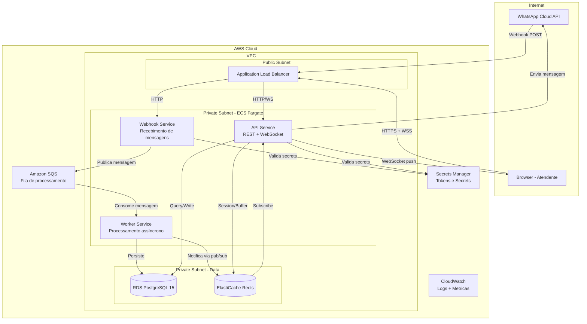
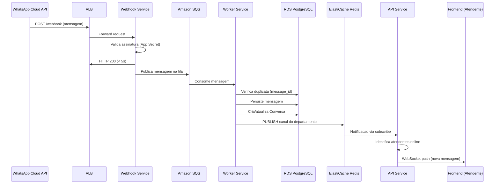
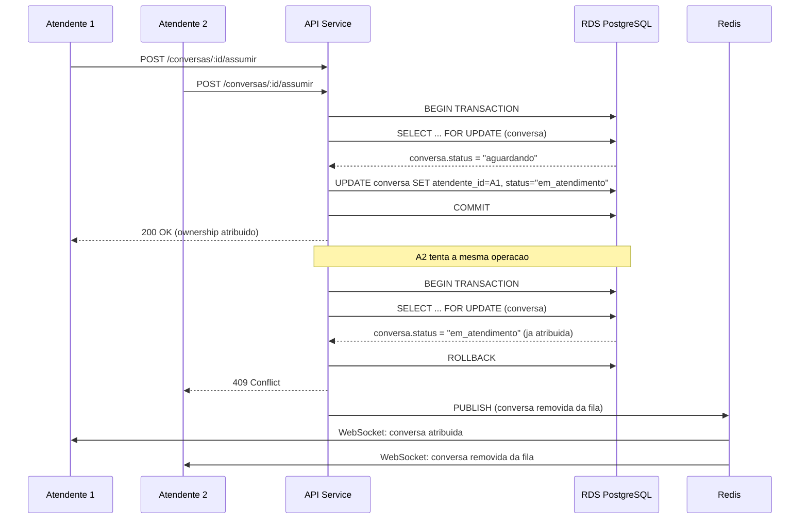
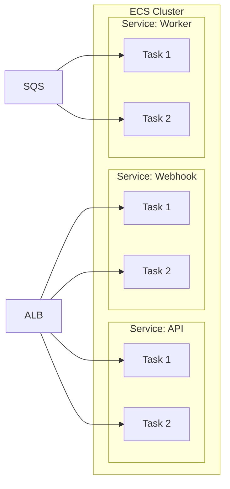
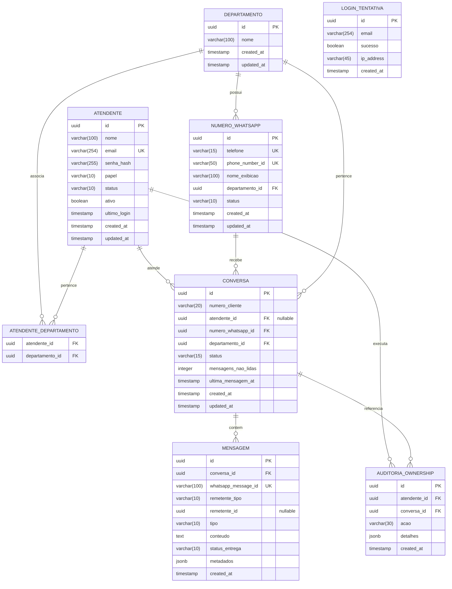

# Design Document: WhatsApp Multi-Agent Panel

## Overview

Este documento descreve a arquitetura e design tecnico do Painel Multiatendente integrado a WhatsApp Cloud API. O sistema permite que multiplos atendentes gerenciem conversas de clientes via WhatsApp em tempo real, com logica de ownership exclusivo garantindo que apenas um atendente atenda cada conversa simultaneamente.

### Decisoes Tecnicas Principais

| Decisao | Escolha | Justificativa |
|---------|---------|---------------|
| Linguagem Backend | Node.js + TypeScript | Event-loop nao-bloqueante ideal para WebSockets e I/O intensivo |
| Deploy | AWS ECS Fargate | Serverless containers, sem gerenciamento de EC2, auto-scaling nativo |
| Banco de Dados | Amazon RDS PostgreSQL 15 | Suporte a partial unique indexes para ownership, JSONB para metadados |
| Cache/Sessao | Amazon ElastiCache Redis | Buffer de mensagens WebSocket, sessoes, rate limiting |
| WebSocket | Application Load Balancer + sticky sessions | Suporte nativo a WebSocket com health checks |
| Frontend | React + TypeScript + Cloudscape Design System | Consistencia com sistema existente |
| Fila de Mensagens | Amazon SQS | Desacoplamento entre webhook handler e processamento |

### Escopo

O sistema cobre:
- Recebimento e envio de mensagens via WhatsApp Cloud API
- Comunicacao em tempo real via WebSocket entre backend e frontend
- Gestao de atendentes, departamentos e numeros WhatsApp
- Fila de espera com ownership exclusivo por conversa
- Historico completo de mensagens com paginacao por cursor
- Controle de acesso por departamento

## Architecture

### Diagrama de Arquitetura de Alto Nivel



### Diagrama de Fluxo de Mensagem Recebida



### Diagrama de Fluxo de Ownership



### Estrategia de Deploy



**Configuracao ECS Fargate:**
- API Service: min 2 tasks, max 10, auto-scaling por CPU/conexoes WebSocket
- Webhook Service: min 2 tasks, max 8, auto-scaling por requisicoes
- Worker Service: min 2 tasks, max 6, auto-scaling por profundidade da fila SQS

## Components and Interfaces

### Estrutura do Projeto

```
whatsapp-panel/
├── src/
│   ├── api/                    # API Service (REST + WebSocket)
│   │   ├── controllers/
│   │   │   ├── auth.controller.ts
│   │   │   ├── atendente.controller.ts
│   │   │   ├── conversa.controller.ts
│   │   │   ├── mensagem.controller.ts
│   │   │   ├── departamento.controller.ts
│   │   │   └── numero-whatsapp.controller.ts
│   │   ├── middlewares/
│   │   │   ├── auth.middleware.ts
│   │   │   ├── validation.middleware.ts
│   │   │   ├── rate-limit.middleware.ts
│   │   │   └── department-access.middleware.ts
│   │   ├── websocket/
│   │   │   ├── ws-server.ts
│   │   │   ├── ws-auth.ts
│   │   │   ├── ws-handlers.ts
│   │   │   └── ws-buffer.ts
│   │   └── routes/
│   │       └── index.ts
│   ├── webhook/                # Webhook Service
│   │   ├── webhook.handler.ts
│   │   ├── signature.validator.ts
│   │   └── payload.parser.ts
│   ├── worker/                 # Worker Service
│   │   ├── message.processor.ts
│   │   ├── conversation.manager.ts
│   │   └── notification.publisher.ts
│   ├── domain/                 # Logica de dominio compartilhada
│   │   ├── entities/
│   │   │   ├── atendente.entity.ts
│   │   │   ├── conversa.entity.ts
│   │   │   ├── mensagem.entity.ts
│   │   │   ├── departamento.entity.ts
│   │   │   └── numero-whatsapp.entity.ts
│   │   ├── services/
│   │   │   ├── ownership.service.ts
│   │   │   ├── fila-espera.service.ts
│   │   │   ├── whatsapp-api.service.ts
│   │   │   └── auth.service.ts
│   │   └── repositories/
│   │       ├── atendente.repository.ts
│   │       ├── conversa.repository.ts
│   │       ├── mensagem.repository.ts
│   │       └── departamento.repository.ts
│   ├── infra/                  # Infraestrutura
│   │   ├── database/
│   │   │   ├── connection.ts
│   │   │   ├── migrations/
│   │   │   └── seeds/
│   │   ├── redis/
│   │   │   ├── client.ts
│   │   │   ├── pubsub.ts
│   │   │   └── buffer.ts
│   │   ├── sqs/
│   │   │   ├── producer.ts
│   │   │   └── consumer.ts
│   │   └── config/
│   │       └── env.ts
│   └── shared/                 # Utilitarios compartilhados
│       ├── types/
│       ├── errors/
│       ├── validators/
│       └── logger.ts
├── tests/
│   ├── unit/
│   ├── integration/
│   └── property/
├── Dockerfile
├── docker-compose.yml
├── package.json
├── tsconfig.json
└── .env.example
```

### Interfaces Principais

#### API REST

```typescript
// === Auth ===
POST   /api/v1/auth/login
POST   /api/v1/auth/logout

// === Atendentes ===
GET    /api/v1/atendentes              // Lista paginada (admin)
POST   /api/v1/atendentes              // Criar (admin)
PATCH  /api/v1/atendentes/:id          // Atualizar (admin)
PATCH  /api/v1/atendentes/:id/status   // Alterar status (proprio)
DELETE /api/v1/atendentes/:id          // Desativar (admin)

// === Conversas ===
GET    /api/v1/conversas               // Conversas ativas do atendente
GET    /api/v1/conversas/fila          // Fila de espera (filtrada por departamento)
POST   /api/v1/conversas/:id/assumir   // Assumir ownership
POST   /api/v1/conversas/:id/finalizar // Finalizar conversa

// === Mensagens ===
GET    /api/v1/conversas/:id/mensagens // Historico paginado (cursor)
POST   /api/v1/conversas/:id/mensagens // Enviar mensagem

// === Departamentos ===
GET    /api/v1/departamentos           // Listar (admin)
POST   /api/v1/departamentos           // Criar (admin)
PATCH  /api/v1/departamentos/:id       // Atualizar (admin)

// === Numeros WhatsApp ===
GET    /api/v1/numeros-whatsapp        // Listar (admin)
POST   /api/v1/numeros-whatsapp        // Cadastrar (admin)
PATCH  /api/v1/numeros-whatsapp/:id    // Atualizar (admin)
POST   /api/v1/numeros-whatsapp/:id/validar // Validar conectividade

// === Webhook (rota publica) ===
GET    /webhook                        // Verificacao do WhatsApp
POST   /webhook                        // Recebimento de mensagens
```

#### WebSocket Events

```typescript
// === Eventos Server -> Client ===
interface WsEvents {
  'nova_mensagem': {
    conversa_id: string;
    mensagem_id: string;
    tipo: 'texto' | 'imagem' | 'documento' | 'audio';
    conteudo: string;
    remetente: 'cliente' | 'atendente';
    timestamp: string;
  };
  'fila_atualizada': {
    total_aguardando: number;
    conversa_adicionada?: string;
    conversa_removida?: string;
  };
  'conversa_atribuida': {
    conversa_id: string;
    atendente_id: string;
  };
  'status_mensagem': {
    mensagem_id: string;
    status: 'enviada' | 'entregue' | 'lida' | 'falha';
  };
  'erro': {
    tipo: string;
    mensagem: string;
    conversa_id?: string;
  };
  'sessao_expirando': {
    segundos_restantes: number;
  };
  'reconexao_buffer': {
    mensagens: Array<WsEvents[keyof WsEvents]>;
  };
}

// === Eventos Client -> Server ===
interface WsClientEvents {
  'heartbeat': {};
  'marcar_lida': { conversa_id: string; mensagem_id: string };
}
```

#### Interfaces de Servico Internas

```typescript
// ownership.service.ts
interface IOwnershipService {
  assumirConversa(atendenteId: string, conversaId: string): Promise<Result<Conversa, OwnershipError>>;
  finalizarConversa(atendenteId: string, conversaId: string): Promise<Result<void, OwnershipError>>;
  liberarConversasOffline(atendenteId: string): Promise<Conversa[]>;
  verificarOwnership(atendenteId: string, conversaId: string): Promise<boolean>;
}

// fila-espera.service.ts
interface IFilaEsperaService {
  listar(departamentoIds: string[], pagina: number): Promise<PaginatedResult<ConversaFila>>;
  adicionarConversa(conversa: Conversa): Promise<void>;
  removerConversa(conversaId: string): Promise<void>;
  contagem(departamentoIds: string[]): Promise<number>;
}

// whatsapp-api.service.ts
interface IWhatsAppApiService {
  enviarMensagemTexto(numeroId: string, destinatario: string, texto: string): Promise<Result<string, WhatsAppError>>;
  enviarTemplate(numeroId: string, destinatario: string, template: TemplateMessage): Promise<Result<string, WhatsAppError>>;
  validarConectividade(phoneNumberId: string, accessToken: string): Promise<boolean>;
}

// auth.service.ts
interface IAuthService {
  login(email: string, senha: string): Promise<Result<TokenPair, AuthError>>;
  validarToken(token: string): Promise<Result<TokenPayload, AuthError>>;
  revogarTokens(atendenteId: string): Promise<void>;
  verificarBloqueio(email: string): Promise<boolean>;
}
```

## Data Models

### Diagrama ER



### DDL Principais

```sql
-- Partial unique index para garantir ownership exclusivo
CREATE UNIQUE INDEX idx_conversa_ownership_exclusivo
ON conversa (atendente_id)
WHERE status = 'em_atendimento' AND atendente_id IS NOT NULL;

-- Index para fila de espera (consultas frequentes)
CREATE INDEX idx_conversa_fila_espera
ON conversa (departamento_id, status, created_at ASC)
WHERE status = 'aguardando';

-- Index para historico por cliente
CREATE INDEX idx_conversa_cliente
ON conversa (numero_cliente, created_at DESC);

-- Index para mensagens por conversa (paginacao por cursor)
CREATE INDEX idx_mensagem_conversa_cursor
ON mensagem (conversa_id, created_at DESC);

-- Index para deduplicacao de mensagens
CREATE UNIQUE INDEX idx_mensagem_whatsapp_id
ON mensagem (whatsapp_message_id)
WHERE whatsapp_message_id IS NOT NULL;
```

### Tipos TypeScript dos Modelos

```typescript
// Enums
type StatusConversa = 'aguardando' | 'em_atendimento' | 'finalizada';
type StatusAtendente = 'online' | 'offline' | 'pausado';
type PapelAtendente = 'admin' | 'atendente';
type TipoMensagem = 'texto' | 'imagem' | 'documento' | 'audio';
type StatusEntrega = 'enviada' | 'entregue' | 'lida' | 'falha';
type RemetenteTipo = 'cliente' | 'atendente';
type StatusNumero = 'ativo' | 'inativo';

// Entidades
interface Atendente {
  id: string;
  nome: string;
  email: string;
  senhaHash: string;
  papel: PapelAtendente;
  status: StatusAtendente;
  ativo: boolean;
  ultimoLogin: Date | null;
  departamentos: Departamento[];
  createdAt: Date;
  updatedAt: Date;
}

interface Conversa {
  id: string;
  numeroCliente: string;
  atendenteId: string | null;
  numeroWhatsappId: string;
  departamentoId: string;
  status: StatusConversa;
  mensagensNaoLidas: number;
  ultimaMensagemAt: Date;
  createdAt: Date;
  updatedAt: Date;
}

interface Mensagem {
  id: string;
  conversaId: string;
  whatsappMessageId: string | null;
  remetenteTipo: RemetenteTipo;
  remetenteId: string | null;
  tipo: TipoMensagem;
  conteudo: string;
  statusEntrega: StatusEntrega;
  metadados: Record<string, unknown>;
  createdAt: Date;
}

interface Departamento {
  id: string;
  nome: string;
  numerosWhatsapp: NumeroWhatsApp[];
  createdAt: Date;
  updatedAt: Date;
}

interface NumeroWhatsApp {
  id: string;
  telefone: string;
  phoneNumberId: string;
  nomeExibicao: string;
  departamentoId: string;
  status: StatusNumero;
  createdAt: Date;
  updatedAt: Date;
}
```

### Estrategia Redis

```typescript
// Chaves Redis utilizadas
const REDIS_KEYS = {
  // Buffer de mensagens WebSocket (TTL: 30s)
  wsBuffer: (atendenteId: string) => `ws:buffer:${atendenteId}`,
  
  // Sessao WebSocket ativa
  wsSession: (atendenteId: string) => `ws:session:${atendenteId}`,
  
  // Canal pub/sub por departamento
  channelDepartamento: (deptId: string) => `channel:dept:${deptId}`,
  
  // Rate limiting de login (TTL: 15min)
  loginAttempts: (email: string) => `login:attempts:${email}`,
  
  // Cache de contagem da fila (TTL: 5s)
  filaContagem: (deptId: string) => `fila:count:${deptId}`,
  
  // Ultimo heartbeat do atendente (TTL: 5min)
  heartbeat: (atendenteId: string) => `heartbeat:${atendenteId}`,
};
```


## Correctness Properties

### Invariantes do Sistema

| ID | Propriedade | Descricao | Mecanismo de Garantia |
|----|-------------|-----------|----------------------|
| CP-1 | Ownership Exclusivo | Uma conversa com status "em_atendimento" possui exatamente um atendente responsavel | Partial unique index no PostgreSQL + transacao com SELECT FOR UPDATE |
| CP-2 | Consistencia de Status | Uma conversa so pode transicionar: aguardando -> em_atendimento -> finalizada | Maquina de estados na entidade de dominio + constraint CHECK no banco |
| CP-3 | Integridade Departamental | Um atendente so acessa conversas de numeros WhatsApp vinculados aos seus departamentos | Middleware de acesso + filtro em todas as queries |
| CP-4 | Deduplicacao de Mensagens | Uma mensagem do WhatsApp (message_id) e processada exatamente uma vez | Unique index condicional em whatsapp_message_id + verificacao antes de INSERT |
| CP-5 | Atomicidade de Ownership | A atribuicao de ownership e atomica - nao existe estado intermediario | Transacao PostgreSQL com isolation level READ COMMITTED |
| CP-6 | Consistencia de Sessao | Um atendente offline nao mantem conversas ativas apos timeout | Job de heartbeat com TTL Redis (5min) + liberacao automatica |
| CP-7 | Ordenacao de Fila | A fila de espera sempre respeita ordem FIFO por timestamp de criacao | Index ordenado (created_at ASC) + query ORDER BY created_at |
| CP-8 | Integridade Referencial | Nenhum registro orfao existe no banco de dados | Foreign keys com ON DELETE RESTRICT (atendentes, clientes) e CASCADE (mensagens) |

### Condicoes de Corrida Identificadas

| Cenario | Risco | Mitigacao |
|---------|-------|-----------|
| Dois atendentes assumem mesma conversa | Ownership duplicado | SELECT FOR UPDATE + verificacao de status pos-lock |
| Mensagem chega durante reconexao WebSocket | Mensagem perdida | Buffer Redis com TTL 30s + entrega na reconexao |
| Atendente desconecta durante envio de mensagem | Mensagem em estado inconsistente | Timeout de 30s na WhatsApp API + status "falha" em caso de erro |
| Worker processa mensagem duplicada do SQS | Mensagem duplicada no banco | Unique index em whatsapp_message_id + INSERT ON CONFLICT DO NOTHING |
| Token JWT expira durante operacao | Operacao incompleta | Validacao de token no inicio de cada request + renovacao antes de expirar |

### Limites e Restricoes

| Recurso | Limite | Justificativa |
|---------|--------|---------------|
| Mensagem texto | 4.096 caracteres | Limite da WhatsApp Cloud API |
| Conteudo armazenado | 65.536 caracteres | Suporte a mensagens com metadados extensos |
| Atendentes por pagina | 50 registros | Performance de listagem |
| Conversas na fila por pagina | 50 registros | Performance de listagem |
| Mensagens por pagina | 50 registros | Performance de scroll |
| Historico de conversas por pagina | 20 registros | Performance de busca |
| Buffer WebSocket | 100 mensagens / 30 segundos | Memoria Redis por atendente |
| Tentativas de login | 5 falhas / 15 minutos | Protecao contra brute force |
| Numeros WhatsApp por departamento | 20 numeros | Limite operacional |
| Departamentos por atendente | 1 a 10 | Limite organizacional |
| Token JWT | 8 horas de validade | Balanco seguranca/usabilidade |
| Retencao de mensagens | 90 dias minimo | Compliance e historico |
| Reconexao WebSocket frontend | 6 tentativas / 5s intervalo | Evitar sobrecarga no servidor |
| Timeout webhook response | 5 segundos | Requisito da WhatsApp Cloud API |
| Timeout envio mensagem | 30 segundos | Tolerancia a latencia da API |
| Timeout validacao numero | 10 segundos | Feedback rapido ao admin |

## Error Handling

### Estrategia Geral

O sistema adota uma abordagem de fail-fast com graceful degradation:
- Erros de validacao sao retornados imediatamente ao cliente com detalhes do campo invalido
- Erros de infraestrutura (DB, Redis, SQS) sao logados e retornados como erro generico ao cliente
- Erros da WhatsApp Cloud API sao tratados com retry limitado e notificacao ao atendente

### Classificacao de Erros

| Classe | HTTP Status | Descricao | Operacional |
|--------|-------------|-----------|-------------|
| ValidationError | 400 | Input invalido do usuario | Sim |
| AuthenticationError | 401 | Token invalido/expirado | Sim |
| AuthorizationError | 403 | Sem permissao | Sim |
| NotFoundError | 404 | Recurso nao encontrado | Sim |
| ConflictError | 409 | Ownership race condition | Sim |
| ExternalServiceError | 502 | WhatsApp API falhou | Sim |
| InternalError | 500 | Bugs, falhas inesperadas | Nao |

### Tratamento por Camada

| Camada | Tipo de Erro | Acao | Resposta ao Cliente |
|--------|-------------|------|---------------------|
| Webhook Service | Assinatura invalida | Log + rejeitar | HTTP 401 |
| Webhook Service | Payload malformado | Log + aceitar | HTTP 200 (evitar reenvio) |
| Webhook Service | SQS indisponivel | Log + retry 3x com backoff | HTTP 200 (aceitar, reprocessar depois) |
| Worker Service | Mensagem duplicada | Ignorar silenciosamente | N/A |
| Worker Service | DB indisponivel | Retry com backoff exponencial | Mensagem volta para SQS (visibility timeout) |
| Worker Service | Redis indisponivel | Log + continuar sem notificacao | Atendente recebe na proxima poll |
| API Service | Token invalido | Rejeitar | HTTP 401 + mensagem generica |
| API Service | Sem permissao departamento | Rejeitar | HTTP 403 |
| API Service | Ownership conflict | Rejeitar | HTTP 409 + mensagem explicativa |
| API Service | WhatsApp API timeout | Log + notificar atendente | WebSocket evento 'erro' |
| API Service | WhatsApp API erro | Persistir com status "falha" | WebSocket evento 'status_mensagem' |
| WebSocket | Token expirado | Notificar + aguardar 60s | Evento 'sessao_expirando' |
| WebSocket | Conexao perdida | Buffer mensagens 30s | Entrega na reconexao |
| Frontend | WebSocket desconectado | Reconexao automatica 5s x 6 | Indicador visual de desconexao |

### Formato Padrao de Resposta de Erro

```json
{
  "error": {
    "code": "OWNERSHIP_CONFLICT",
    "message": "Esta conversa ja foi assumida por outro atendente.",
    "details": [
      { "field": "email", "constraint": "Formato de email invalido" }
    ],
    "request_id": "req_abc123"
  }
}
```

Codigos de erro padrao:
- VALIDATION_ERROR - Dados invalidos na requisicao
- AUTHENTICATION_FAILED - Token invalido ou expirado
- DEPARTMENT_ACCESS_DENIED - Sem acesso ao departamento
- OWNERSHIP_CONFLICT - Conversa ja assumida por outro atendente
- AGENT_PAUSED - Atendente pausado nao pode assumir conversas
- MESSAGE_TOO_LONG - Mensagem excede 4096 caracteres
- OUTSIDE_24H_WINDOW - Apenas templates permitidos fora da janela 24h
- ACCOUNT_LOCKED - Conta bloqueada apos tentativas de login
- WHATSAPP_API_ERROR - Erro na comunicacao com WhatsApp Cloud API
- NUMBER_INACTIVE - Numero WhatsApp inativo
- NUMBER_VALIDATION_FAILED - Falha na validacao de conectividade

### Politica de Retry

| Operacao | Max Retries | Backoff | Timeout Total |
|----------|-------------|---------|---------------|
| Envio WhatsApp API | 0 (sem retry) | N/A | 30s |
| Publicacao SQS | 3 | Exponencial (1s, 2s, 4s) | 10s |
| Conexao PostgreSQL | 5 | Exponencial (500ms base) | 30s |
| Conexao Redis | 3 | Linear (1s) | 5s |
| Worker processamento (via SQS) | 3 (visibility timeout) | SQS managed | N/A |

### Metricas e Alarmes CloudWatch

| Metrica | Tipo | Alarme |
|---------|------|--------|
| webhook_requests_total | Counter | > 1000/min (possivel ataque) |
| webhook_signature_failures | Counter | > 10/min |
| message_processing_duration_ms | Histogram | p99 > 5000ms |
| ownership_conflicts_total | Counter | > 50/min (possivel problema) |
| websocket_connections_active | Gauge | < 2 (possivel problema de conectividade) |
| sqs_queue_depth | Gauge | > 1000 (worker nao acompanha) |
| whatsapp_api_errors_total | Counter | > 20/min |
| login_failures_total | Counter | > 100/min (possivel brute force) |

## Testing Strategy

### Piramide de Testes

- Unit Tests: 100+ testes de logica de dominio (base)
- Integration Tests: 20-30 testes de fluxo entre componentes (meio)
- E2E Tests: 5-10 cenarios criticos completos (topo)

### Testes Unitarios

Foco: Logica de dominio isolada, sem dependencias externas.

| Modulo | O que testar | Ferramentas |
|--------|-------------|-------------|
| Entidades | Validacoes, transicoes de estado, regras de negocio | Jest + ts-jest |
| Services | Logica de ownership, fila, auth (com mocks de repositorio) | Jest + jest-mock |
| Validators | Schemas zod, sanitizacao de input | Jest |
| Middlewares | Auth, rate-limit, department-access (com mocks de request) | Jest + supertest |

Cenarios unitarios criticos:
- Conversa nao pode transicionar de "finalizada" para "em_atendimento"
- Atendente pausado nao pode assumir conversa
- Mensagem com mais de 4096 chars e rejeitada
- Email duplicado e rejeitado na criacao de atendente
- Token JWT expirado e rejeitado
- Bloqueio de login apos 5 tentativas falhas

### Testes de Integracao

Foco: Interacao entre componentes com banco de dados e Redis reais (via docker-compose).

| Fluxo | Componentes Envolvidos | Verificacao |
|-------|----------------------|-------------|
| Ownership atomico | API + PostgreSQL | Dois requests simultaneos: um sucede, outro recebe 409 |
| Webhook -> SQS -> Worker | Webhook + SQS + Worker + PostgreSQL | Mensagem persiste corretamente no banco |
| Notificacao real-time | Worker + Redis + API + WebSocket | Atendente recebe push apos mensagem processada |
| Login + bloqueio | API + Redis + PostgreSQL | 5 falhas bloqueiam, 6a retorna erro de bloqueio |
| Fila por departamento | API + PostgreSQL | Atendente so ve conversas do seu departamento |
| Buffer reconexao | API + Redis + WebSocket | Mensagens entregues na reconexao dentro de 30s |

Ambiente: docker-compose com PostgreSQL 15, Redis 7, LocalStack (SQS).

### Testes End-to-End

| Cenario | Descricao |
|---------|-----------|
| Atendimento completo | Login -> ver fila -> assumir conversa -> enviar mensagem -> finalizar |
| Concorrencia de ownership | 2 atendentes tentam assumir mesma conversa simultaneamente |
| Reconexao WebSocket | Desconectar -> mensagens chegam -> reconectar -> receber buffer |
| Controle departamental | Atendente A nao ve conversas do departamento B |
| Fluxo webhook completo | Simular POST do WhatsApp -> mensagem aparece no painel do atendente |

### Ferramentas

| Ferramenta | Uso |
|-----------|-----|
| Jest | Test runner, assertions, mocking |
| ts-jest | Suporte TypeScript no Jest |
| Supertest | Testes HTTP para API REST |
| ws (client) | Testes de WebSocket |
| Testcontainers | PostgreSQL e Redis em containers para CI |
| Faker.js | Geracao de dados de teste |
| Docker Compose | Ambiente local de integracao |

### Cobertura Minima Recomendada

| Camada | Cobertura Minima | Justificativa |
|--------|-----------------|---------------|
| Domain (entities + services) | 90% | Logica critica de negocio |
| API (controllers + middlewares) | 80% | Validacao e autorizacao |
| Webhook + Worker | 85% | Processamento de mensagens |
| Infra (repositories) | 70% | Queries SQL testadas via integracao |
| Frontend (componentes) | 60% | Interacoes criticas do usuario |
